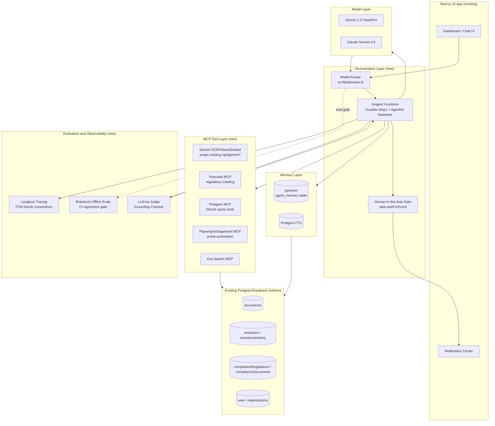

# VerdeIQ Agentic AI Strategy 2026
## A 76-Layer Deep-Research Audit and Build Plan for Autonomous ESG Intelligence in Cyprus

Prepared as an internal strategy document. Scope: Cyprus SME sustainability platform, EU/EEA regulatory context, Next.js 15 / TypeScript / Drizzle + Postgres (Supabase) / Better Auth / Google Gemini / Stripe / Resend stack.

Date of research: 2026. Sources cited inline with URLs. All numbers are sourced or explicitly marked as estimates.

---

## Table of Contents

1. Executive summary
2. The 2026 agentic landscape
3. Standards and protocols
4. Framework survey
5. Model layer
6. Memory architectures
7. Retrieval
8. Tool ecosystems
9. Workflow engines and durability
10. Evaluation and observability
11. Safety, guardrails, PII
12. Voice and multimodal agents
13. Vertical application — 15 agent features
14. Reference architecture
15. Build vs buy matrix
16. 90-day rollout plan
17. Pricing and packaging
18. Competitive scan
19. Risks and open questions
20. Appendix

---

## 1. Executive summary — the 5 agentic moves that make VerdeIQ undeniable

VerdeIQ already has the substrate most competitors lack: a live Gemini integration (`/api/gemini/{stream,analyze,vision,embed}`), a Postgres/Drizzle schema with 35+ domain tables (emissions, compliance, documents, offsets, LMS), and a shipped autonomous pipeline (grant-alerts, cron-driven, source-scraped, matched, emailed). That is 70% of the plumbing an agent needs: tools, data, a delivery channel, a scheduler. The gap is orchestration, memory, and durability — not raw AI capability.

Five moves, in priority order:

1. **Ship the CBAM Report Agent as the flagship "AI FTE."** Cyprus SMEs importing cement, steel, aluminium, fertilisers, hydrogen, or electricity from outside the EU face binding CBAM declarant obligations from January 2026 (definitive regime; the transitional reporting period ended Q4 2025 under Regulation (EU) 2023/956, as implemented by Commission Implementing Regulation (EU) 2023/1773). A single autonomous agent that ingests customs data, supplier emissions declarations, and EU default values, then produces a submission-ready CBAM report, is worth more to a 20-person Cyprus importer than the entire rest of the platform combined. This is the wedge.
2. **Make the platform "always-on" instead of "session-based."** Every competitor (Watershed, Sweep, Persefoni) is moving from chat-assistant to ambient agent — background jobs that watch regulatory feeds, utility bills, and supplier responses, and interrupt the user only when a decision is needed. VerdeIQ's grant-alerts cron is proof this pattern already works in this codebase. Replicate it for compliance monitoring, tariff switching, and Scope 3 supplier chasing.
3. **Adopt MCP as the internal tool contract, not just an external nicety.** Every Gemini tool call, every OCR extraction, every EAC tariff lookup should be exposed as an MCP tool. This future-proofs VerdeIQ for Anthropic/OpenAI/Google's converging tool ecosystems and lets the same tool surface serve a chat agent, a cron agent, and — eventually — third-party auditor agents via A2A.
4. **Buy durability, do not build it.** Inngest (already durable-execution-native, TypeScript-first, Vercel-compatible) should become the backbone for every long-running or multi-step agent job: CBAM generation, supplier surveys, invoice ingestion. This converts "cron script that might silently fail" into "durable, replayable, observable workflow" for near-zero build cost.
5. **Price the agent layer as an "AI FTE" tier, not a feature toggle.** Positioning: "VerdeIQ Autopilot replaces 0.3 FTE of your accountant's CSRD workload." Charge per-report-generated or per-agent-seat above the core subscription, with a visible "autonomy dial" (co-pilot → autopilot → autonomous) so risk-averse Cyprus SMEs and their auditors trust the system before ceding control.

These five moves compound: (1) is the proof point, (2) is the retention engine, (3) is the technical foundation, (4) is the reliability guarantee that makes (1) and (2) safe to sell, and (5) is how it becomes a 3-5x ARPU expansion instead of a cost center.

---

## 2. The 2026 agentic landscape

"Agentic" in 2026 has converged on a specific technical meaning, distinct from 2023's "chatbot with tools." The core primitives:

- **Planner/executor separation.** A planning model decomposes a goal into a task graph; execution can be handled by cheaper/faster models or deterministic code. AI SDK v5 and LangGraph both formalize this as `plan → act → observe → replan` (ReAct-style loop). Source: https://ai-sdk.dev/v5/docs/agents/overview — "Agents are large language models (LLMs) that use tools in a loop to accomplish tasks."
- **Tool use as the atomic unit of agency.** The industry has stabilized on JSON-schema-defined tool/function calling as the interface between model and world. This is no longer a differentiator; it is table stakes across OpenAI, Anthropic, Gemini.
- **Reflection and self-critique.** Agents that generate an output, critique it against a rubric (or a second model), and revise before returning — critical for regulated outputs like ESRS disclosures, where a plausible-sounding hallucination is worse than a refusal.
- **Multi-agent systems and Mixture-of-Agents (MoA).** Instead of one god-agent, specialised agents (a "Scope 3 data agent," a "narrative-writing agent," an "auditor-tone agent") collaborate via a shared state or message bus. LangGraph's multi-agent supervisor pattern and Inngest AgentKit's "networks" both formalize this.
- **Deep research patterns.** Multi-hop web/document research where an agent iteratively searches, reads, and synthesizes over many steps before answering — the pattern behind OpenAI's Deep Research, Google's Gemini Deep Research, and Perplexity's research mode. Directly applicable to VerdeIQ's "regulatory horizon scanner" and "benchmarking research agent" (see Section 13).
- **Ambient agents.** Agents that run on a schedule or event trigger with no user in the loop, surfacing only exceptions. This is the dominant 2025-2026 pattern for B2B SaaS (see Watershed's "Agents" product below) and matches VerdeIQ's existing grant-alerts cron model exactly.
- **Computer-use and browser agents.** Agents that operate a real browser or OS (Claude Computer Use, OpenAI Operator, Browserbase + Stagehand) to complete tasks with no API — critical for VerdeIQ because EAC, Cyprus Tax Department, and many EU grant portals have no API and only a web form.

The strategic read for VerdeIQ: the frontier is not "smarter chat," it is "fewer humans required in the loop, more trust earned per autonomous action." Every layer below should be read through that lens.

---

## 3. Standards and protocols

### 3.1 Model Context Protocol (MCP)
Anthropic's open protocol (announced Nov 2024, now at spec version 2025-06-18 / 2025-11-25) standardizes how LLM applications discover and call external tools and data sources over JSON-RPC, with a client-host-server architecture, capability negotiation, and an authorization framework built in. Source: https://modelcontextprotocol.io/specification/2025-11-25 and https://modelcontextprotocol.io/specification/2025-06-18/architecture

MCP has become the de facto tool-exposure layer across OpenAI, Google (Gemini supports MCP tool calling), and the AI SDK (`ai-sdk.dev` has native MCP client support: https://ai-sdk.dev/v5/docs/agents/building-agents references "Model Context Protocol (MCP)" as a first-class doc section).

**VerdeIQ implication:** wrap every internal capability (EAC tariff lookup, OCR bill parser, CBAM default-value lookup, Drizzle query helpers) as an MCP server. This is a ~2-3 day investment that pays off the moment VerdeIQ wants to (a) let its own multiple agents share tools without duplicating glue code, (b) plug in third-party MCP servers (Firecrawl, Exa, filesystem, Postgres) with zero custom integration, and (c) eventually expose a "VerdeIQ MCP server" so an accountant's own Claude/ChatGPT can query a client's emissions data with permission — a distribution channel competitors do not have.

### 3.2 Agent2Agent (A2A)
Google's open protocol for agent-to-agent interoperability, announced April 9 2025, donated to the Linux Foundation June 23 2025 with AWS, Cisco, Microsoft, Salesforce, SAP, ServiceNow as founding members. It defines Agent Cards (capability discovery), task lifecycle, and secure opaque-agent communication so agents built on different stacks can delegate work to each other. Sources: https://developers.googleblog.com/en/a2a-a-new-era-of-agent-interoperability/ and https://developers.googleblog.com/google-cloud-donates-a2a-to-linux-foundation/ ; spec repo https://github.com/google/A2A (25k+ stars).

**VerdeIQ implication:** A2A matters the moment VerdeIQ needs to hand off work to an external agent it does not control — e.g., an accounting firm's own agent requesting a client's Scope 3 rollup, or a future "auditor agent" verifying a CBAM report. Not urgent for 2026 MVP, but design the agent boundary (Section 14) so an A2A adapter can be bolted on later without a rewrite. MCP for tools, A2A for agent-to-agent handoff — do not conflate the two.

### 3.3 Agent Communication Protocol (ACP) and others
IBM/BeeAI's ACP and various REST-based agent registries exist but have far less adoption than MCP/A2A as of 2026. Not recommended for VerdeIQ; MCP + A2A cover the real needs.

### 3.4 OpenAI Agents SDK and Anthropic Agent Skills
OpenAI's Agents SDK (successor to Swarm) provides handoffs, guardrails, and tracing primitives in Python and TypeScript. Anthropic's "Agent Skills" (filesystem-based, versioned capability packages a Claude agent can load on demand) are a lightweight alternative to heavyweight tool schemas for narrow, well-defined procedures — a strong fit for "how to fill VSME Module B1" style knowledge.

**VerdeIQ implication:** VerdeIQ is Gemini-first today, but should NOT hard-lock into a single vendor's agent SDK. Build the orchestration layer on AI SDK v5 (model-agnostic) so Claude, GPT, or Gemini can be swapped per-task via a model router (Section 5), and treat "Agent Skills"-style markdown procedure packs as the pattern for encoding ESRS/VSME/CBAM domain procedures — cheap to author, cheap to update when EFRAG changes a standard.

### 3.5 Structured tool calling and JSON schema
Function/tool calling has converged on JSON Schema across all three major providers. Gemini's `responseSchema` / function declarations, OpenAI's `tools` with strict mode, and Anthropic's `tool_use` blocks are functionally equivalent. AI SDK v5's `tool()` helper with Zod schemas is the recommended abstraction — write once, run on any provider. Source: https://ai-sdk.dev/v5/docs/foundations/tools

---

## 4. Framework survey

Scored 1-5 for VerdeIQ fit (TypeScript-native, Next.js/Vercel compatibility, durability, learning curve, ecosystem maturity).

| Framework | What it is | TS-native | Durable | Vercel/Next fit | VerdeIQ fit | Verdict |
|---|---|---|---|---|---|---|
| **AI SDK v5 (Vercel)** | Model-agnostic generation, tool-calling, and agent loop primitives (`generateText` with `tools`, `stopWhen`, `prepareStep`) | Yes | No (ephemeral by default) | Native — same team as Next.js | 5/5 | **Adopt as the base layer for all agent logic.** Already directionally used by VerdeIQ (Gemini calls). Docs: https://ai-sdk.dev/v5/docs/agents/overview |
| **Inngest + AgentKit** | Durable step functions plus a thin agent/network layer (deterministic routing, MCP tool support) built on top | Yes | Yes — every LLM call and tool call is a checkpointed step | Native — official Vercel integration | 5/5 | **Adopt as the orchestration/durability layer.** Wrap AI SDK calls in Inngest steps. Docs: https://www.inngest.com/docs/learn/durable-agents and https://github.com/inngest/agentkit |
| **LangGraph** | Graph-based stateful multi-agent orchestration, Python-first (JS SDK exists but is second-class) | Partial | Yes (checkpointers) | Weak — no official Vercel-first support | 3/5 | Powerful for very complex branching multi-agent flows (e.g., the CBAM agent's multi-step supplier-data reconciliation). Consider for that one workflow only, run as a separate service, not the platform default. |
| **CrewAI** | Role-based multi-agent framework (Python), fastest to prototype "team of agents" | No (Python) | No | None | 1/5 | Skip — wrong language, adds a second runtime to operate. |
| **OpenAI Agents SDK** | Handoffs, guardrails, tracing; Python and TS versions | Yes (TS SDK) | No | Moderate | 2/5 | Skip as primary — ties orchestration conceptually to OpenAI's worldview while VerdeIQ is Gemini-first and must stay model-agnostic. Fine as inspiration for guardrail patterns only. |
| **Mastra** | TypeScript-first agent framework, Vercel-aligned, workflows + agents + RAG built in | Yes | Partial (own workflow engine) | Strong | 3/5 | Credible alternative to hand-rolling AI SDK + Inngest glue. Re-evaluate in 90 days once its workflow engine's durability guarantees are proven at VerdeIQ's scale; do not block the 90-day plan on it. |
| **Temporal** | General-purpose durable execution, battle-tested (Uber, Stripe, Netflix), any language | Yes (TS SDK) | Yes — the gold standard | Requires self-hosted worker or Temporal Cloud, no serverless-native Vercel story | 2/5 | Overkill for VerdeIQ's 2026 needs; adds ops burden (worker fleet) disproportionate to team size. Revisit only if VerdeIQ agent volume exceeds what Inngest's pricing/scale comfortably handles. |
| **LlamaIndex Workflows** | Event-driven workflows, strong RAG/document parsing ecosystem (LlamaParse) | Partial (Python-first, TS lags) | Partial | Weak | 2/5 | Skip as orchestrator; **do** evaluate LlamaParse as a document-ingestion tool (Section 8), independent of the workflow engine. |
| **AutoGen (Microsoft)** | Multi-agent conversation framework, Python | No | No | None | 1/5 | Skip. |

Sources for 2026 comparisons: https://andrew.ooo/answers/langgraph-vs-crewai-vs-mastra-vs-openai-agents-april-2026/ ; https://nesyona.com/articles/best-ai-agent-frameworks-2026 ; https://bananalabs.io/blog/best-ai-agent-frameworks-2026 ("LangGraph is the most common production choice in 2026 for complex stateful agents... CrewAI leads on readability and multi-agent scenarios; Mastra leads on TypeScript... Framework choice matters less than evaluation, observability, and integration maturity").

**Decision: AI SDK v5 for generation/tool-calling + Inngest AgentKit for durability/orchestration.** This is the only combination that (a) matches the existing stack exactly, (b) requires zero new runtime/language, (c) gives durable execution for free, and (d) has first-class MCP support on both sides.

---

## 5. Model layer

### 5.1 Frontier models in play (2026 snapshot)
- **Claude Opus 4.5 / Sonnet 4.5 / "Mythos Preview"** — Anthropic leads most agentic and coding benchmarks in early-to-mid 2026: SWE-bench Verified 87.6-93.9% depending on release, GAIA (Princeton HAL) leadership at 74.6% for Sonnet 4.5. Source: https://rapidclaw.dev/blog/ai-agent-benchmarks-2026 ("Claude Opus 4.7 leads SWE-bench Verified at 87.6%; Claude Sonnet 4.5 leads GAIA... at 74.6%") and https://codersera.com/blog/ai-agent-benchmarks-state-of-leaderboard-may-2026/.
- **GPT-5.x / GPT-5.5 / GPT-5.2 Pro** — leads general intelligence indices (Artificial Analysis Intelligence Index) and GDPval (real economic task win-rate vs human experts, 74.1%). Source: same codersera roundup.
- **Gemini 2.5/3 Pro** — VerdeIQ's incumbent model. Strong multimodal (PDF, image, long-context) performance, native fit for utility-bill OCR and vision tasks already wired via `/api/gemini/vision`. Gemini's price/performance and existing integration make it the default execution model; route only high-stakes reasoning/compliance-critical steps to Claude or GPT where budget allows (Section 5.3).
- **DeepSeek and open-source (Llama, Qwen, Mistral)** — commodity-tier reasoning at a fraction of the cost; suitable for low-stakes, high-volume tasks (e.g., first-pass classification of an invoice's document type) where a wrong answer is cheaply corrected downstream.

### 5.2 Benchmarks that matter for VerdeIQ, and why generic leaderboards mislead
No single benchmark predicts production reliability for a compliance-adjacent agent. The right framing, echoed across 2026 sources: "a model that scores 95% on one leaderboard and 45% on another has not gotten stupider... the benchmarks are measuring different things" (https://iotdigitaltwinplm.com/ai-agent-benchmarks-swe-bench-gaia-tau-bench-2026/). For VerdeIQ:
- **tau-bench** (multi-turn tool-use with a simulated user and business policy constraints) is the closest proxy for "agent talks to an SME owner, follows the rules, uses tools correctly." Weight this most heavily for the CBAM/VSME agents.
- **GAIA** (multi-hop real-world research with tools) is the proxy for the regulatory horizon scanner and benchmarking research agent.
- **SWE-bench** is irrelevant to VerdeIQ's product surface (it measures coding agents) — ignore it for model selection, use it only when picking a coding copilot for VerdeIQ's own engineering team.

### 5.3 Model routing strategy
Do not pick one model. Build a thin router:

```ts
// src/lib/ai/router.ts
type Task =
  | "ocr-bill" | "chat-quick" | "cbam-narrative"
  | "esrs-gap-analysis" | "classification" | "horizon-scan";

const ROUTES: Record<Task, { provider: "gemini" | "anthropic" | "openai"; model: string; maxCostUsd: number }> = {
  "ocr-bill":          { provider: "gemini",    model: "gemini-2.5-flash", maxCostUsd: 0.01 },
  "chat-quick":        { provider: "gemini",    model: "gemini-2.5-flash", maxCostUsd: 0.01 },
  "classification":    { provider: "gemini",    model: "gemini-2.5-flash-lite", maxCostUsd: 0.002 },
  "cbam-narrative":    { provider: "anthropic", model: "claude-sonnet-4.5", maxCostUsd: 0.20 }, // compliance-critical prose
  "esrs-gap-analysis": { provider: "anthropic", model: "claude-sonnet-4.5", maxCostUsd: 0.20 },
  "horizon-scan":      { provider: "gemini",    model: "gemini-2.5-pro", maxCostUsd: 0.05 },   // long-context reg text
};
```

Rule of thumb: **Gemini for volume (OCR, chat, classification, long-context regulatory text) because it is already wired and cheapest at scale; Claude Sonnet for compliance-critical narrative generation** (CBAM reports, ESRS disclosures) because it benchmarks best on tau-bench-style policy-following and produces the most audit-defensible prose with the fewest hallucinated figures. This is a two-provider strategy, not a single-vendor one — the incremental integration cost (one AI SDK provider adapter) is trivial and buys real quality where it is needed most.

---

## 6. Memory architectures

Three memory types, mapped to VerdeIQ user journeys:

- **Episodic memory** — what happened in this reporting cycle ("uploaded March EAC bill, flagged anomaly, user confirmed it was a meter change"). Maps to a `agent_events` table plus embeddings.
- **Semantic memory** — durable facts about the SME ("registered NACE code, 4 sites, uses diesel generators as backup, prior-year Scope 1 = 42 tCO2e"). This is what makes a returning user's second CSRD cycle 80% faster than the first — the system should never ask the same onboarding question twice.
- **Procedural memory** — how VerdeIQ itself should behave for this specific client ("this client's auditor wants footnotes in Greek," "this client always disputes the EAC grid factor and needs the source cited inline"). Rare but high-value; store as structured preferences, not vector soup.

### 6.1 Tooling comparison
| Option | Model | Fit for VerdeIQ |
|---|---|---|
| **pgvector on existing Supabase Postgres** | Roll-your-own embeddings + retrieval | **Adopt.** Zero new infra, already have Postgres, already have an `embed` Gemini endpoint. Sufficient for semantic memory at VerdeIQ's scale (thousands of SMEs, not billions of vectors). |
| **Mem0** | Managed/self-hosted memory layer bolted onto any agent framework | Evaluate in Q2 2026 once agent memory needs get more complex than "facts about the client + past reports." Source describes it as "the fastest to bolt on" (https://vectorize.io/articles/mem0-vs-letta). Do not adopt yet — pgvector covers the near-term need at lower cost and no vendor lock-in for regulated client data. |
| **Letta (MemGPT)** | Full agent runtime with built-in memory management (self-editing memory blocks) | Skip. It is a runtime, not a bolt-on layer (https://vectorize.io/articles/mem0-vs-letta) — adopting it means replacing the orchestration choice made in Section 4. Not worth the coupling. |
| **Zep / Cognee** | Temporal knowledge-graph memory | Skip for 2026; revisit if GraphRAG-style entity relationships (supplier ↔ facility ↔ emission factor ↔ regulation) become central — see Section 7.4. |

### 6.2 Concrete schema addition
```sql
-- extends existing Drizzle schema.ts
CREATE TABLE agent_memory (
  id uuid PRIMARY KEY DEFAULT gen_random_uuid(),
  organization_id uuid NOT NULL REFERENCES "user"(id),
  memory_type text NOT NULL CHECK (memory_type IN ('episodic','semantic','procedural')),
  content text NOT NULL,
  embedding vector(768), -- Gemini text-embedding-004 dimension
  source_ref text,       -- e.g. 'report:cbam-2026-q1', 'document:doc_id'
  confidence real DEFAULT 1.0,
  created_at timestamptz DEFAULT now(),
  expires_at timestamptz -- episodic memory can decay; semantic/procedural should not
);
CREATE INDEX ON agent_memory USING hnsw (embedding vector_cosine_ops);
```
Retrieval: on every agent run, pull top-k semantic memories for the organization (facts) plus recent episodic memories (last 90 days), inject as system context. This is the single highest-leverage change for making VerdeIQ's assistant feel like it "knows the client" across a multi-year reporting relationship — a moat none of the transactional competitors bother building for SME-tier accounts.

---

## 7. Retrieval

### 7.1 RAG 2.0 baseline
Naive chunk-and-embed RAG under-performs for regulatory text because a chunk loses its position in the standard's hierarchy (which ESRS topic, which disclosure requirement, which paragraph). Anthropic's **Contextual Retrieval** (prepend a short LLM-generated context blurb to every chunk before embedding, reducing retrieval failure by 35-49% in Anthropic's own tests) is the correct baseline for VerdeIQ's ESRS/VSME/CBAM knowledge base. Source: https://www.anthropic.com/engineering/contextual-retrieval ; reference notebook: https://github.com/anthropics/claude-cookbooks/blob/ca0dd33d/capabilities/contextual-embeddings/guide.ipynb

### 7.2 Hybrid search and reranking
Combine pgvector semantic search with Postgres full-text search (`tsvector`) for exact regulatory citations (SMEs and auditors both need to find "Article 6, Annex I" verbatim, which embeddings alone handle poorly). Add a reranking pass — Cohere Rerank or Voyage AI rerank-2 — before the final top-k is sent to the model. This is a cheap (~$1-2 per 1000 queries) accuracy multiplier and should be standard for any answer that will appear verbatim in a client-facing report.

### 7.3 Agentic retrieval
Instead of one-shot RAG, let the agent decide it needs another search after reading the first batch of chunks ("this ESRS E1 answer references E5 circularity — pull that section too"). AI SDK v5's multi-step tool loop supports this natively: expose `search_knowledge_base` as a tool the model can call repeatedly rather than pre-fetching context.

### 7.4 GraphRAG and ESG knowledge graphs
GraphRAG (entity- and relationship-aware retrieval, e.g. Microsoft's GraphRAG, or lighter approaches like Milvus's Graph RAG tutorial: https://milvus.io/docs/v2.5.x/contextual_retrieval_with_milvus.md) is worth building specifically for **Scope 3 supplier chains** — modeling supplier → facility → emission-factor → regulation as a graph makes "which of my suppliers are affected by the new CBAM default value update" a graph traversal instead of a fuzzy search. This is a Q3 2026 investment, not a 90-day one; pgvector + contextual retrieval covers the MVP.

### 7.5 ESG-domain knowledge base sourcing
Build the corpus from: EFRAG ESRS standards and Q&A platform, EU Taxonomy Compliant Assessment templates, CBAM Implementing Regulation and default-value tables, Cyprus Energy Regulatory Authority (CERA) tariff schedules, EAC grid emission factor publications. Re-crawl quarterly with Firecrawl (Section 8) and re-embed only changed sections (hash-diff at the paragraph level) to keep costs low.

---

## 8. Tool ecosystems

| Category | Tool | VerdeIQ use case | Adopt? |
|---|---|---|---|
| **Browser automation** | Stagehand + Browserbase | Fill EAC/CERA portal forms, Cyprus Tax Department lookups, EU grant portal applications where no API exists | Adopt for one flagship flow (EAC tariff-switch advisor) after MVP; keep human-approval gate before submission |
| **Computer use** | Claude Computer Use / OpenAI Operator | Full OS-level automation — overkill and too immature for regulated financial submissions in 2026 | Defer to 2027 |
| **Search** | Exa, Tavily, Perplexity API | Regulatory horizon scanner, benchmarking research agent, grant-alerts sourcing (extends existing `eu-funding.ts`/`cyprus.ts` scrapers) | Adopt Exa for semantic/neural search of regulatory changes; keep existing scrapers for known structured sources |
| **Scraping** | Firecrawl, ScrapingBee | Turn EFRAG/EU Official Journal/CERA pages into clean markdown for the knowledge base | Adopt Firecrawl (has a clean MCP server: `firecrawl-mcp`) |
| **Document AI** | Reducto, Unstructured, LlamaParse, Docling | High-fidelity parsing of scanned EAC bills, supplier PDFs, customs declarations, audit trail PDFs — better table/layout fidelity than raw Gemini vision alone for dense financial tables | Adopt Docling (open-source, self-hostable, no per-page vendor fee) as a pre-processor feeding Gemini vision; evaluate LlamaParse for CBAM customs documents specifically (complex nested tables) |
| **Form-filling automation** | Custom + Stagehand | VSME/CBAM portal auto-fill | Build in-house on top of Stagehand once the underlying report data is validated |

MCP servers exist off-the-shelf for Firecrawl, filesystem, Postgres, and Playwright — wire these directly into the MCP tool layer (Section 3.1) rather than writing bespoke API clients.

---

## 9. Workflow engines and durability

Agents fail mid-task constantly: a third-party API times out, a Gemini call gets rate-limited, a user closes the tab during a 40-second multi-step generation. Without durable execution, all progress is lost and the user sees a spinner-then-error. Source: https://www.inngest.com/docs/learn/durable-agents — "Most agent frameworks treat execution as ephemeral... if that process crashes, times out, or gets deployed over, everything is gone... A durable agent is different. Every step... is checkpointed."

**Decision: Inngest.** Rationale:
- Already the natural next step from the existing `grant-alerts` cron pipeline (`.github/workflows/grant-alerts.yml`, `src/app/api/cron/grant-alerts`) — that pipeline is a single-shot script; Inngest turns it into a resumable, retryable, per-step-observable function with zero infrastructure to run (serverless, deploys alongside Next.js on Vercel).
- Native TypeScript, native Next.js route handler integration (`inngest/next`).
- AgentKit gives multi-agent "network" primitives with MCP tool support out of the box, so Section 3.1's MCP investment is directly reusable.
- Vastly less operational burden than Temporal (no worker fleet to run) at VerdeIQ's current scale (hundreds to low-thousands of Cyprus SMEs).

Human-in-the-loop pattern: Inngest supports `step.waitForEvent()` — an agent can pause indefinitely, send the user a Resend email or in-app notification ("Confirm supplier X's emission factor before I finalize the CBAM report"), and resume exactly where it left off when the user responds. This is the correct mechanical pattern for every agent in Section 13 that touches a number that will appear in a regulatory filing — **no agent should auto-submit a filing without an explicit human confirmation step**, enforced structurally, not just by prompt instruction.

Idempotency: every external side effect (sending an email, calling a government portal, charging a Stripe credit) must be wrapped with an idempotency key derived from `(organizationId, taskId, stepName)` so a workflow replay after a crash never double-sends or double-charges.

---

## 10. Evaluation and observability

| Tool | Role | Adopt? |
|---|---|---|
| **Langfuse** | Open-source LLM tracing, prompt management, cost tracking, self-hostable (data residency-friendly for EU/GDPR) | **Adopt.** Self-hostable in the EU is a real advantage for a Cyprus/EU compliance product handling client financial data — do not send traces to a US-only SaaS by default. |
| **Braintrust** | Eval-focused, strong dataset/experiment workflow for regression-testing prompts | Adopt for offline eval suites specifically (e.g., "does the CBAM narrative generator still cite the correct default value after a prompt change") — run in CI. |
| **LangSmith** | Best-in-class if using LangGraph; redundant otherwise | Skip — avoid unless the CBAM LangGraph sub-workflow (Section 4) grows large enough to need it. |
| **Helicone / Arize Phoenix** | Lightweight proxy-based tracing / ML observability | Skip initially — Langfuse covers the need. |
| **OpenTelemetry GenAI semantic conventions** | Standardizing span attributes for LLM calls (`gen_ai.system`, `gen_ai.request.model`, token counts) | **Adopt the convention regardless of vendor** — instrument Inngest steps and AI SDK calls with OTel GenAI attributes so traces are portable between Langfuse and any future tool. |

LLM-as-judge: for every autonomously generated report section, run a second, cheaper model as a judge against a rubric ("does this paragraph cite a real EU regulation article; does every number trace to a document_id in the `documents` table"). Fail closed — if the judge flags an unverifiable claim, route to human review rather than auto-publish. This "grounding checker" is non-negotiable for anything CSRD/CBAM-facing (see Section 19).

Red-teaming: quarterly adversarial testing — inject deliberately wrong utility-bill data, ambiguous supplier responses, and prompt-injection attempts (a malicious PDF in a supplier survey response) and confirm the agent asks for clarification or flags anomalies rather than confidently fabricating a number.

---

## 11. Safety, guardrails, PII

### 11.1 EU AI Act classification
The EU AI Act (Regulation (EU) 2024/1689, in force from August 2024, phased obligations through 2027) is the binding framework. Source: https://digital-strategy.ec.europa.eu/en/policies/regulatory-framework-ai and Article 6 classification rules: https://ai-act-service-desk.ec.europa.eu/en/ai-act/article-6

VerdeIQ's honest self-assessment: a carbon-accounting/ESG-reporting-assistance AI system is **not** on the Annex III high-risk list (which covers biometrics, critical infrastructure, employment/HR decisions, credit scoring, law enforcement, migration, justice/democratic processes). VerdeIQ's agents inform and draft; they do not make an autonomous legal/financial decision with binding effect on a natural person's rights (the report is still submitted, reviewed, and signed by the SME/accountant). This places VerdeIQ's agentic features at **limited-risk / minimal-risk** for most components, subject to:
- **Transparency obligations (Article 50)**: users must be told they are interacting with an AI system when the assistant/agent generates content — already natural via UI labeling ("Drafted by VerdeIQ AI — review before submitting").
- **No fully autonomous filing.** Do not let any agent submit a CBAM/CSRD filing to a government or auditor system without an explicit human approval click. This keeps VerdeIQ decisively outside any argument that the system is "making" a compliance decision, and is also just good practice (Section 9).
- **Documentation discipline.** Even at minimal/limited risk, keep a technical file per agent (purpose, data used, known limitations, evaluation results from Section 10) — cheap now, mandatory-feeling later if scope creeps toward higher-risk classification as the Act's guidance evolves.

**Do not self-classify as high-risk voluntarily** — that would trigger conformity assessment, a risk-management system, and quality-management documentation disproportionate to VerdeIQ's stage. Revisit if VerdeIQ ever markets the product as making autonomous determinations of legal compliance status (a genuinely different, higher-risk claim) rather than assisting the human preparer.

### 11.2 GDPR posture
All processing must stay EU/EEA-resident given Supabase Postgres region pinning and Cyprus SME data. Practical requirements:
- **Data Processing Agreements** with every model provider used for anything containing personal data (Anthropic, Google, Cohere/Voyage) — confirm EU data residency options or use `europe-west` Vertex AI endpoints for Gemini calls handling personal data, rather than default global endpoints.
- **No training on customer data** — verify contractual opt-out is enabled with every provider (Gemini API, Anthropic API); this is standard for paid API tiers but confirm explicitly.
- **PII minimization before embedding** — strip personal names/emails from documents before they enter the vector store where feasible; supplier survey responses in particular often contain named individual contacts.

### 11.3 Guardrail tooling
- **Presidio (Microsoft, open-source)** for PII detection/redaction before documents are embedded or sent to any external API — adopt, self-hosted, no cost, EU-friendly.
- **Guardrails AI / NeMo Guardrails** for structured-output validation and topic/scope fencing (keep the assistant from answering outside its ESG/compliance domain, and from generating anything resembling legal advice framed as certainty) — adopt a lightweight subset (output schema validation + a scope classifier), skip the heavier NeMo stack given team size.
- **Prompt-injection defense** — treat every ingested document (utility bill OCR text, supplier survey free-text response) as untrusted input; never let extracted document text be interpreted as system instructions. Structurally separate "instructions" from "data" in every prompt template (this is a prompt-engineering discipline, not a product to buy).

---

## 12. Voice and multimodal agents

- **Realtime APIs** (OpenAI Realtime, Gemini Live API) enable a spoken conversational agent — relevant for a "materiality assessment interviewer" agent (Section 13) conducting a structured interview with a busy SME owner who will not fill out a 40-question web form but will talk for 12 minutes on a call. Gemini Live is the natural choice given VerdeIQ's existing Gemini contract and multilingual (EN/EL) requirement — confirm Greek language support quality before committing the flagship UX to it; fall back to a scripted EL/EN toggle chat interview if voice-EL quality is not yet production-grade.
- **ElevenLabs / Cartesia** for TTS if VerdeIQ wants a spoken output (e.g., an audio summary of the board report) — nice-to-have, not core.
- **PDF-native reasoning and chart/image understanding** — Gemini's native multimodal PDF ingestion (already used via `/api/gemini/vision`) is the right tool for utility bills and financial statements; supplement with Docling (Section 8) specifically for dense multi-column customs/CBAM tables where layout fidelity determines correctness of a declared quantity.

---

## 13. Vertical application — 15 concrete agent features

Each feature: user story, agent design, commercial value, effort (S/M/L), moat, priority (P0-P2).

### 13.1 CBAM Report Agent — P0, Effort L
**User story:** "As a Cyprus importer of steel/cement/aluminium, I upload my customs declarations and supplier data, and VerdeIQ produces a CBAM-compliant quarterly report I can review and submit."
**Agent design:** Inngest durable workflow. Tools: `parse_customs_declaration` (Docling + Gemini vision), `lookup_cn_code_default_value` (MCP tool over EU default-value tables), `match_supplier_declaration` (fuzzy match against uploaded supplier data or fallback to EU default), `generate_narrative` (Claude Sonnet 4.5), `grounding_check` (LLM-as-judge verifying every number traces to a source document). Human approval gate before "finalize." Memory: semantic memory of prior-quarter supplier mappings so re-runs get faster each cycle.
**Commercial value:** highest-willingness-to-pay feature; CBAM declarant obligations are legally binding from Jan 2026 with financial penalties for non-compliance — this is a "must-buy," not a "nice-to-have."
**Moat:** deep default-value/CN-code knowledge base plus Cyprus-specific customs data patterns; expensive for a generalist competitor to replicate for a small market.
**Priority: P0 — build first.**

### 13.2 Always-on ESRS Compliance Monitor — P0, Effort M
**User story:** "Tell me the moment a regulatory change affects my materiality assessment, without me checking anything."
**Agent design:** Ambient Inngest cron (daily), extends the grant-alerts pattern exactly. Tools: `crawl_efrag_updates` (Firecrawl), `diff_against_prior_snapshot`, `assess_relevance_to_org` (embeds org's material topics, compares to change). Delivers via existing Resend pipeline + in-app notification (`notifications` table already exists in schema).
**Commercial value:** retention driver — the reason a subscriber does not churn after their first report is filed.
**Moat:** compounds with tenure; a competitor entering later cannot replicate a client's multi-year change history.
**Priority: P0.**

### 13.3 Scope 3 Supplier Survey Agent — P1, Effort M
**User story:** "Chase my 40 suppliers for emissions data without me sending 40 emails manually."
**Agent design:** Inngest workflow generates a personalized survey link per supplier, sends via Resend, parses free-text/spreadsheet responses (Gemini + Docling), flags implausible answers (LLM-as-judge sanity check against sector benchmarks), auto-escalates non-responders after N days with an escalating reminder tone.
**Commercial value:** Scope 3 is the largest reporting burden and the most-avoided category — automating it directly reduces churn from "this is too much work."
**Moat:** supplier-response knowledge base compounds across VerdeIQ's client base (the same steel supplier answers surveys from multiple VerdeIQ clients — with consent, aggregate and reuse validated factors).
**Priority: P1.**

### 13.4 Energy Invoice / EAC Bill Ingestion Agent — P0, Effort S
**User story:** "I forward my EAC bill PDF by email and my Scope 2 numbers update themselves."
**Agent design:** Extends existing `/api/gemini/vision` OCR. Add: dedicated email inbound address (Resend inbound), Inngest workflow parses, cross-checks against the EAC grid factor (~610 gCO2/kWh, 24% renewables — already in VerdeIQ's domain knowledge), writes to `emissions`/`historicalEmissions` tables, flags anomalies (>20% month-over-month change) for human confirmation.
**Commercial value:** removes the single most repetitive manual task SME owners currently do.
**Moat:** low — but essential baseline; ship first because it feeds every other agent's data.
**Priority: P0 — build immediately, low effort/high leverage.**

### 13.5 Grant/Tender Scout Agent — P1, Effort S (extends shipped pipeline)
**User story:** current grant-alerts users get matched grants; extend it to also draft the first paragraph of an application referencing the SME's actual emissions data.
**Agent design:** Extend `src/lib/grant-alerts/matcher.ts` with a generation step once a match score exceeds threshold; pulls org data from `sustainabilityMetrics`, drafts an eligibility paragraph, stores as a draft document in `documents` table.
**Commercial value:** converts a passive-alert feature into an active-drafting feature — meaningful upsell trigger.
**Moat:** already shipped infrastructure; nobody else has Cyprus-specific grant sourcing at all.
**Priority: P1 — cheapest possible win, reuses existing code.**

### 13.6 Auditor Collaboration Agent — P2, Effort M
**User story:** "My external auditor can ask VerdeIQ's agent direct questions about how a number was calculated, with full source-document traceability, without another back-and-forth email chain."
**Agent design:** Read-only agent scoped to a specific report, with a full citation trail (every figure links to a `documents.id` and calculation methodology). Exposed via a scoped, time-limited access link; long-term exposed as an MCP server so the auditor's own AI tools can query it directly.
**Commercial value:** audit-readiness is a top-3 buying criterion for CFOs; a good auditor experience becomes a referral engine.
**Moat:** requires the grounding/citation discipline built for 13.1 and 13.9 — hard to bolt on later if not designed in from the start.
**Priority: P2 — build after the grounding-check infrastructure is proven in 13.1.**

### 13.7 "What-If" Reduction Pathway Simulator — P1, Effort M
**User story:** "Show me three ways to cut Scope 1+2 by 30% by 2030 and what each costs."
**Agent design:** Deterministic simulation engine (not just LLM narrative) — a constrained optimizer over known levers (solar PV install, EV fleet transition, EAC tariff/time-of-use switching, efficiency retrofits) with cost/payback data for Cyprus; LLM wraps the simulator's output in plain-language narrative and answers follow-up "what about X" questions by re-running the simulator as a tool call.
**Commercial value:** turns VerdeIQ from a reporting tool into a decision-support tool — the difference between a compliance cost center and a strategic budget line.
**Moat:** requires a genuinely Cyprus-calibrated cost/lever database (local solar costs, EAC tariff structure, subsidy programs) — a generalist EU competitor's numbers will be wrong for Cyprus.
**Priority: P1.**

### 13.8 Board-Report Writer Agent — P1, Effort S
**User story:** "Generate a 2-page board-ready sustainability summary from this quarter's data, in English or Greek."
**Agent design:** Single-shot but citation-grounded generation, template-constrained (VerdeIQ-branded layout), bilingual via Gemini's strong EN/EL support; pulls from `dashboardMetrics`, `sustainabilityGoalsProgress`, `industryComparisons`.
**Commercial value:** immediately visible "wow" output for a CFO/board audience — strong demo and sales-enablement asset.
**Moat:** low technically, but the polish (design, bilingual quality, benchmark context) is a real differentiator vs generic chatbot output.
**Priority: P1 — cheap, high visual impact, good for sales.**

### 13.9 Benchmarking Research Agent — P2, Effort M
**User story:** "How does my emissions intensity compare to other Cyprus hospitality SMEs my size?"
**Agent design:** Deep-research pattern (Section 2) — agent iteratively queries `industryComparisons` table, supplements gaps with Exa web search of published sector reports, synthesizes a defensible comparison with cited sources, flags where data is thin.
**Commercial value:** the "wow, it actually researched this" moment that separates an agent from a chatbot; strong differentiator in sales demos.
**Moat:** requires an accumulating internal benchmark dataset across VerdeIQ's own client base — compounds with client count, unavailable to a new entrant.
**Priority: P2.**

### 13.10 Regulatory Horizon Scanner — P1, Effort M (shares infra with 13.2)
**User story:** "What's changing in EU sustainability regulation in the next 12 months that will affect me?"
**Agent design:** Same crawl/diff infrastructure as 13.2 but broader scope (EU Official Journal, EFRAG, CBAM implementing acts, Omnibus simplification proposals) with a longer-horizon, less urgent cadence (weekly digest rather than instant alert).
**Commercial value:** positions VerdeIQ as a trusted advisor, not just a filing tool — supports premium/consultant-tier pricing.
**Moat:** shares infrastructure with 13.2; marginal cost to add once that pipeline exists.
**Priority: P1.**

### 13.11 Procurement Decarbonisation Copilot — P2, Effort M
**User story:** "Which of my suppliers should I switch to reduce Scope 3, and what's the cost tradeoff?"
**Agent design:** Combines Scope 3 survey data (13.3) with a supplier-alternatives search (Exa/web) and cost-benefit narrative; genuinely useful only once 13.3's data exists.
**Commercial value:** moves VerdeIQ into the procurement workflow — a natural adjacent upsell to accounting-firm and larger-SME clients.
**Priority: P2 — sequence after 13.3.**

### 13.12 EAC Bill Parser + Tariff-Switching Advisor — P1, Effort M
**User story:** "Tell me if I should switch EAC tariff plan or time-of-use band to save money and cut emissions."
**Agent design:** Builds on 13.4's parsed bill data; adds a browser-automation step (Stagehand) to check current published CERA/EAC tariff schedules, computes a cost/emissions comparison, presents a recommendation with a human-approval step before any account-level action.
**Commercial value:** directly saves the SME money, not just compliance effort — the single easiest agent feature to sell on ROI alone.
**Moat:** Cyprus-specific tariff knowledge, EAC-specific bill format parsing tuned over many real bills.
**Priority: P1.**

### 13.13 VSME Auto-Fill Agent — P0, Effort M
**User story:** "Fill in the Voluntary SME (VSME) standard's Basic and Comprehensive modules for me from data I've already given VerdeIQ."
**Agent design:** Since VSME is explicitly designed for SMEs (EFRAG's proportionate standard, positioned as the "ceiling" for what large companies can request from SME suppliers under CSRD value-chain cap provisions), this is VerdeIQ's most natural and lowest-friction agent — mostly a structured mapping problem from existing tables (`sustainabilityMetrics`, `emissionsHistory`, `complianceRegulations`) into the VSME's fixed module structure, with an LLM writing only the narrative/qualitative fields.
**Commercial value:** VSME is becoming the default "give my customer what they're asking for" response for thousands of EU SMEs being pulled into CSRD value chains in 2026-2027 — high volume, low complexity per report, ideal for aggressive per-report pricing (Section 17).
**Moat:** first-mover on VSME automation in the Cyprus market.
**Priority: P0 — high volume, moderate effort, strong ROI.**

### 13.14 Materiality Assessment Interviewer Agent — P2, Effort M
**User story:** "Instead of a 40-question form, have a 15-minute conversation with me (voice or chat) to determine my material ESG topics."
**Agent design:** Gemini Live (Section 12) or scripted chat fallback; structured interview graph (LangGraph is a legitimate fit here specifically, given the branching-conversation shape) that adapts questions based on sector (NACE code) and prior answers, outputs a structured double-materiality assessment.
**Commercial value:** materiality assessment is the single most-dreaded first step of CSRD/VSME onboarding; making it conversational removes the biggest onboarding drop-off point.
**Priority: P2 — sequence after voice-EL quality is validated (Section 12 caveat).**

### 13.15 Portfolio-Level Roll-Up Agent for Accounting Firms — P1, Effort L
**User story:** "As an accounting firm managing 30 SME clients on VerdeIQ, give me one dashboard and one agent that flags which clients are behind schedule, and drafts a consolidated summary across my portfolio."
**Agent design:** Multi-agent supervisor pattern (LangGraph or Inngest AgentKit network) — a coordinator agent queries per-client status from each of 13.1-13.13's underlying data, aggregates, and drafts a portfolio memo; anomaly flags trigger notifications to the firm, not the SME.
**Commercial value:** this is the wedge into the accounting-firm / consultant channel — a fundamentally different, higher-ACV go-to-market than direct SME sales, and the natural distribution partner for a Cyprus market where most SMEs already outsource compliance to an accountant.
**Moat:** requires the full stack above to already exist per-client; a strong reason to build 13.1-13.13 first.
**Priority: P1 — sequence last among P0/P1 items, but flag early to sales as the accounting-firm channel unlock.**

**Priority summary:** P0 (build in 90-day plan): 13.1 CBAM, 13.2 ESRS Monitor, 13.4 Bill Ingestion, 13.13 VSME Auto-Fill. P1 (next): 13.5, 13.3, 13.7, 13.8, 13.10, 13.12, 13.15. P2 (later): 13.6, 13.9, 13.11, 13.14.

---

## 14. Reference architecture



### Flagship data flow — CBAM Report Agent, step by step

1. **Trigger.** User uploads customs declarations and supplier docs to `documents` table via existing upload UI, or the quarterly Inngest cron fires automatically for organizations with CBAM obligations flagged in `complianceSettings`.
2. **Ingest step (Inngest step 1, durable checkpoint).** `parse_customs_declaration` tool (Docling → Gemini vision via `/api/gemini/vision`) extracts CN codes, quantities, country of origin, per line item. Checkpointed — if this step fails, retries do not re-run the whole workflow.
3. **Lookup step.** For each line item, `lookup_cn_code_default_value` MCP tool queries the internal EU CBAM default-value table (kept fresh via a Firecrawl-based ingestion job against the EU Implementing Regulation source).
4. **Supplier reconciliation step.** `match_supplier_declaration` checks if the SME has an actual supplier-provided emissions declaration on file (from the Scope 3 Supplier Survey Agent, 13.3); if yes, use actual data (lower cost to importer under CBAM rules); if no, fall back to EU default value and flag this for the SME (falling back to defaults is materially more expensive from Jan 2026, real financial incentive to chase supplier data).
5. **Memory read.** Router pulls semantic memory (`agent_memory`, type=semantic) for this organization — prior quarter's supplier mappings, known recurring anomalies — to speed and improve step 4.
6. **Narrative generation.** Router sends structured data to Claude Sonnet 4.5 (compliance-critical prose route from Section 5.3) to draft the report narrative and footnotes.
7. **Grounding check (LLM-as-judge).** A second, cheaper model call verifies every number in the draft traces to a `documents.id` or the default-value table; anything unverifiable is flagged red, not silently included.
8. **Human-in-the-loop gate.** `step.waitForEvent()` pauses the workflow; Resend email + in-app notification sent to the SME/accountant: "Your CBAM report is ready for review — 2 line items flagged as using default values, review before submitting."
9. **Approval.** User reviews in-app, edits if needed, clicks approve. Workflow resumes.
10. **Finalize.** PDF generated, stored in `documents`, episodic memory event written (`agent_memory`, type=episodic) for future-cycle learning, Langfuse trace closed with full step-by-step cost/latency/token record, Braintrust eval sample logged for periodic regression testing.

---

## 15. Build vs buy matrix

| Layer | Build in-house | Buy/adopt | Decision and why |
|---|---|---|---|
| Agent generation loop | — | AI SDK v5 | Buy — it is free, open-source, official Vercel/Next.js tooling, model-agnostic |
| Durable orchestration | Custom queue on Postgres | Inngest | Buy — durability is a solved problem; building it is pure risk with no differentiation |
| Multi-agent coordination | — | Inngest AgentKit (primary), LangGraph (CBAM sub-flow only if needed) | Buy — do not hand-roll a scheduler/supervisor |
| Tool protocol | Custom REST glue | MCP | Buy (adopt standard) — future interoperability, ecosystem of pre-built servers |
| Vector store | pgvector on existing Supabase | Pinecone/Turbopuffer/Mem0 | Build on existing infra — no new vendor, no new data-residency question, sufficient scale for years |
| Memory layer | Custom `agent_memory` table + retrieval logic | Mem0/Letta | Build — thin custom logic on pgvector is cheaper and keeps client data fully in VerdeIQ's own EU-resident Postgres |
| Document parsing | — | Docling (self-hosted, open-source) + Gemini vision | Buy/adopt open-source — avoid per-page vendor lock-in (Reducto/LlamaParse) unless CBAM table complexity demands it |
| Web search | — | Exa | Buy — building a search index is out of scope |
| Scraping | Extend existing scrapers (`grant-alerts/sources/*`) | Firecrawl for new/unstructured sources | Hybrid — keep existing structured scrapers, add Firecrawl only for regulatory-text sources needing markdown conversion |
| Browser automation | — | Stagehand + Browserbase | Buy — reliable browser automation is a genuinely hard, well-solved-elsewhere problem |
| Observability/tracing | — | Langfuse (self-hosted) | Buy but self-host — EU data residency, open-source, avoid another US SaaS subprocessor |
| Offline evals | Custom test harness | Braintrust | Buy — eval tooling maturity is not worth reinventing |
| Guardrails/PII | — | Presidio (self-hosted) | Buy open-source — well-solved, no reason to build entity-recognition from scratch |
| CBAM/VSME/ESRS domain knowledge base | Build (content + structuring) | — | Build — this is VerdeIQ's actual IP and moat; no vendor sells "Cyprus CBAM default value table, kept current" |
| Model router | Build (thin wrapper, ~100 LOC) | — | Build — trivial and must stay under VerdeIQ's control to swap providers freely |

**Principle applied throughout:** buy every horizontal capability that is a solved, commoditized problem (durability, tracing, search, scraping, browser control); build only what encodes VerdeIQ's actual domain expertise (Cyprus/EU ESG knowledge, the model router, the memory schema tuned to reporting cycles). This keeps the engineering team small and focused on the 20% that is genuinely differentiated.

---

## 16. 90-day rollout plan

Mapped to the existing codebase. Assumes a small team (2-4 engineers) building on top of the current stack.

### Weeks 1-2 — Foundations
- Stand up Inngest in the Next.js app (`inngest.config.ts`, `/api/inngest` route handler, mirroring the pattern already used for `/api/cron/grant-alerts`).
- Migrate the existing grant-alerts pipeline (`src/lib/grant-alerts/runner.ts`, `store.ts`, `emailer.ts`) from raw cron script to an Inngest durable function — this is the training-wheels migration that proves the pattern before building new agents on it, and immediately gets grant-alerts retry/observability for free.
- Add `agent_memory` table via Drizzle migration (Section 6.2).
- Stand up Langfuse (self-hosted, Docker on existing infra or Langfuse Cloud EU region) and instrument the existing `/api/gemini/*` routes with OTel GenAI trace attributes.
- Build the model router (`src/lib/ai/router.ts`) with Gemini + Claude Sonnet providers wired via AI SDK v5 provider adapters.

### Weeks 3-5 — Ship the EAC Bill Ingestion Agent (13.4) and VSME Auto-Fill (13.13, part 1: data mapping)
- Add Resend inbound-email address for bill forwarding.
- Build Inngest workflow: parse → validate → write to `emissions`/`historicalEmissions` → anomaly flag → notification via existing `notifications` table.
- Begin structuring the VSME module schema as a Drizzle table (`vsmeReports`) mapping to existing `sustainabilityMetrics`/`emissionsHistory` fields; identify data gaps that require new input UI.
- Add Presidio PII scrubbing step before any document content is embedded.

### Weeks 6-8 — Ship the Always-on ESRS Compliance Monitor (13.2) and Regulatory Horizon Scanner (13.10)
- Build Firecrawl-based crawl job (Inngest cron, daily) against EFRAG and EU Official Journal sources.
- Build the contextual-retrieval knowledge base ingestion pipeline (chunk, contextualize via Gemini Flash, embed, store in `agent_memory`/dedicated `knowledge_base` table).
- Build the diff-and-relevance-scoring step, wire to Resend + in-app notification.
- Wrap this crawl/diff infra so it is directly reusable for the horizon scanner (broader, weekly-cadence variant) — ship both from one codebase.

### Weeks 9-12 — Ship the CBAM Report Agent (13.1), the flagship
- Build `lookup_cn_code_default_value` MCP tool over an internally maintained default-value table (populate from the EU Implementing Regulation, refresh quarterly via the crawl infra from weeks 6-8).
- Build the Docling-based customs-declaration parser as an MCP tool.
- Build the full Inngest durable workflow per Section 14's step-by-step flow, including the `step.waitForEvent()` human approval gate.
- Wire Claude Sonnet 4.5 as the narrative-generation model via the router.
- Build the LLM-as-judge grounding checker and wire a Braintrust offline eval suite (sample CBAM scenarios, run in CI on every prompt change).
- Complete VSME auto-fill narrative generation (13.13, part 2) using the same grounding-checker infrastructure — ships in the same window since it reuses most of the CBAM plumbing.
- Alpha-test both agents with 3-5 design-partner Cyprus SMEs (ideally importers already known to need CBAM compliance) before general release.

### Ongoing/parallel track
- Weekly red-team session against the grounding checker (Section 10) starting week 6.
- Draft the EU AI Act technical-file documentation for each agent as it ships, not retroactively (Section 11.1).

---

## 17. Pricing and packaging implications

**Core principle: price the agent tier on outcomes delivered, not tokens consumed.** SME buyers do not want to think about token costs; they want to know "will this replace work I currently pay an accountant to do."

- **Base subscription (existing tiers)** — keep as-is: dashboard, manual data entry, basic reporting, chat assistant (current Gemini experience).
- **"Autopilot" add-on tier** — priced per report-type generated per cycle (e.g., a flat fee per CBAM quarterly report, per VSME annual report), not per API call. This maps buyer mental model to accountant-invoice mental model ("this report normally costs me €800 in accountant hours; VerdeIQ Autopilot is €150").
- **"AI FTE" positioning for the accounting-firm channel (13.15)** — price per-portfolio, e.g., a flat monthly fee scaling with number of managed clients, explicitly marketed as "adds 0.5-1.0 FTE of capacity to your sustainability practice." This is a fundamentally different sales motion (B2B2B) from direct SME subscription and should have its own pricing page and sales collateral.
- **Autonomy dial** — expose three modes per agent in the UI: **Co-pilot** (agent suggests, human does everything manually), **Autopilot** (agent drafts, human approves each output — the Section 9 default), **Autonomous** (agent completes routine, low-risk tasks like bill ingestion without per-instance approval, still logged and reversible). Charge a premium for Autonomous mode once trust is established over 2-3 successful cycles — this also serves as a natural expansion-revenue trigger ("you've approved 8/8 EAC bill ingestions correctly — switch to Autonomous mode for €X/month less review time").
- **Credits vs seats** — use credits (consumable, expire quarterly, aligned to reporting cycles) for variable-cost agent runs (research agent, benchmarking agent), and flat per-report pricing for the two flagship compliance agents (CBAM, VSME) where cost variance is predictable and buyers hate metered pricing for compliance-critical deliverables.
- **Do not charge for the ESRS Compliance Monitor and Horizon Scanner directly** — bundle these into the base/Autopilot subscription as retention infrastructure (Section 1, move 2); their commercial value is churn reduction, not direct revenue, and metering them would undermine the "always watching for you" trust proposition.

---

## 18. Competitive scan

- **Watershed** — has shipped a genuine agentic product ("Agents," https://watershed.com/platform/sustainability-ai) with customer testimony of "12 weeks per year" saved and "2 days to finish an SB 261 report... 6x faster." This is enterprise-tier (large corporates, US climate disclosure focus) and not Cyprus/SME-relevant in market, but it is the clearest proof that agentic ESG reporting is now a proven, sellable category, not a research bet — validates VerdeIQ's roadmap direction, not a direct competitor in Cyprus SME.
- **Sweep** — explicitly markets "Sweepy," an agentic AI layer for sustainability data management (https://www.sweep.net/blog/how-sweeps-agentic-ai-transforms-sustainability-data-management), mid-market EU focus, CSRD-centric. This is the closest positioning analogue to VerdeIQ's ambition, but operates at mid-market/enterprise ACV, not Cyprus-SME price points.
- **Greenly** — 3,500+ clients, markets "AI-Powered ESRS Data Co[llection]" and "Integrated EFRAG-Compliant Scoring" (https://greenly.earth/en-gb/products/csrd-reporting) — strong SMB/mid-market European presence, closest overall competitor by segment, but no visible CBAM-specific agent or Cyprus/EAC-specific tooling.
- **Persefoni, Normative, Plan A, Sinai** — established carbon-accounting platforms, all adding AI-assisted data collection and reporting narrative generation through 2025-2026, but none have a visible Cyprus-specific or EAC-grid-specific product angle, and none have publicly shipped a CBAM-specific autonomous report generator as of this research.

**VerdeIQ's leapfrog thesis:** every named competitor is either (a) enterprise-tier and economically uninterested in a Cyprus SME account, or (b) EU-generalist and structurally unable to build Cyprus-specific tooling (EAC tariff data, CERA schedules, Cyprus grant/tender sourcing, Greek-language reporting) at the fidelity a local player can, because the Cyprus SME market is too small to justify a generalist's localization investment. VerdeIQ's wedge is **"Cyprus-native + agent-native"** — narrow enough geography that deep, correct local automation (EAC bill parsing, CERA tariff switching, Cyprus grant sourcing already shipped) is actually worth building, combined with agentic depth (CBAM, VSME, always-on monitoring) that most SME-tier competitors have not yet shipped because their AI investment is still chat-assistant-level. This is a genuine, defensible niche, not a "we're smaller so we're scrappier" story.

---

## 19. Risks and open questions

- **Hallucination in regulated reporting.** The single biggest risk. Mitigation is structural, not just prompt-based: mandatory grounding-check (Section 10), mandatory human-approval gate before any filing (Section 9/11), citation-to-source-document discipline built into the schema from day one (Section 14). No agent should ever be trusted to "know" a regulatory number from training data alone — every figure must resolve to a document, a database lookup, or an explicit default-value table entry.
- **Auditability.** Every autonomous decision must be reconstructable months later when an actual auditor asks "how did VerdeIQ arrive at this number." Langfuse trace retention plus the `agent_memory` episodic log must be retained for the statutory audit-trail period (align with Cyprus company-law document retention requirements, typically 6-7 years) — this has real storage-cost and data-governance implications, plan for it now rather than as an afterthought.
- **EU AI Act evolution.** The Act's high-risk annex and guidance are still being actively clarified through 2026-2027; a future amendment could plausibly bring "AI systems used in regulatory compliance determination" into a higher-risk category. Mitigation: maintain the technical-file discipline now (Section 11.1) so re-classification is a paperwork exercise, not an architecture rebuild, and keep the "assists, does not decide" framing structurally true (human approval gates), not just a marketing claim.
- **Cost blowups.** Multi-step agentic workflows with LLM-as-judge double-checking can multiply token cost 3-5x versus a single chat completion. Mitigation: the model router's per-task cost ceiling (Section 5.3), aggressive caching of regulatory-text embeddings (they change rarely), and routing high-volume/low-stakes steps to Gemini Flash-Lite rather than frontier models.
- **Model deprecation and provider drift.** Anthropic/Google/OpenAI regularly deprecate model versions on 6-12 month cycles. Mitigation: the AI SDK v5 abstraction (Section 4) and the router pattern (Section 5.3) mean a model swap is a one-line config change, not a prompt-template rewrite, provided prompts avoid model-specific quirks.
- **Over-automation and trust erosion.** If an "Autonomous" mode agent makes even one visible mistake on a compliance-adjacent number, customer trust in the entire platform (not just that agent) can collapse — SME owners and their accountants are risk-averse by nature. Mitigation: the autonomy-dial default should start conservative (Section 17), require a proven track record before offering full autonomy, and always keep an undo/edit path visible.
- **Open question: EL-language voice quality.** Gemini Live's Greek support quality for a spoken materiality interview (13.14) is unverified as of this research — validate before committing that feature's UX to voice rather than chat.
- **Open question: CBAM default-value table maintenance ownership.** Someone on the team must own quarterly verification of the EU CBAM default-value table against the official Implementing Regulation updates — this is a compliance-critical data asset, not a "set and forget" scrape.

---

## 20. Appendix

### Key links and sources cited in this document
- MCP specification: https://modelcontextprotocol.io/specification/2025-11-25 , https://modelcontextprotocol.io/specification/2025-06-18/architecture , https://modelcontextprotocol.io/specification/2025-06-18/server/tools
- A2A protocol: https://developers.googleblog.com/en/a2a-a-new-era-of-agent-interoperability/ , https://developers.googleblog.com/google-cloud-donates-a2a-to-linux-foundation/ , https://github.com/google/A2A
- AI SDK v5: https://ai-sdk.dev/v5/docs/agents/overview , https://ai-sdk.dev/v5/docs/agents/building-agents , https://ai-sdk.dev/v5/docs/foundations/tools , https://vercel.com/kb/guide/how-to-build-ai-agents-with-vercel-and-the-ai-sdk
- Inngest / AgentKit: https://agentkit.inngest.com/ , https://www.inngest.com/docs/learn/durable-agents , https://www.inngest.com/blog/ai-agents-inngest-durable-steps , https://github.com/inngest/agentkit
- Framework comparisons 2026: https://andrew.ooo/answers/langgraph-vs-crewai-vs-mastra-vs-openai-agents-april-2026/ , https://nesyona.com/articles/best-ai-agent-frameworks-2026 , https://bananalabs.io/blog/best-ai-agent-frameworks-2026 , https://agentos.sh/blog/agentos-vs-langgraph-vs-crewai/
- Benchmarks: https://rapidclaw.dev/blog/ai-agent-benchmarks-2026 , https://codersera.com/blog/ai-agent-benchmarks-state-of-leaderboard-may-2026/ , https://iotdigitaltwinplm.com/ai-agent-benchmarks-swe-bench-gaia-tau-bench-2026/
- Memory: https://vectorize.io/articles/mem0-vs-letta , https://mcp.directory/blog/mem0-vs-letta-vs-zep-vs-cognee-2026
- Retrieval: https://www.anthropic.com/engineering/contextual-retrieval , https://github.com/anthropics/claude-cookbooks/blob/ca0dd33d/capabilities/contextual-embeddings/guide.ipynb , https://milvus.io/docs/v2.5.x/contextual_retrieval_with_milvus.md
- Regulation: EU AI Act — https://digital-strategy.ec.europa.eu/en/policies/regulatory-framework-ai , https://ai-act-service-desk.ec.europa.eu/en/ai-act/article-6 ; CBAM Regulation (EU) 2023/956 and Implementing Regulation (EU) 2023/1773 (official text via EUR-Lex)
- Competitors: https://watershed.com/platform/sustainability-ai , https://watershed.com/solutions/csrd , https://www.sweep.net/blog/how-sweeps-agentic-ai-transforms-sustainability-data-management , https://greenly.earth/en-gb/products/csrd-reporting

### Glossary
- **A2A** — Agent2Agent protocol, agent-to-agent interoperability standard (Google/Linux Foundation).
- **AgentKit** — Inngest's agent/multi-agent-network layer built on its durable execution engine.
- **CBAM** — Carbon Border Adjustment Mechanism, EU import-carbon-pricing regulation.
- **CSRD** — Corporate Sustainability Reporting Directive.
- **EFRAG** — European Financial Reporting Advisory Group, author of ESRS.
- **ESRS** — European Sustainability Reporting Standards.
- **GraphRAG** — retrieval-augmented generation using a knowledge graph rather than flat vector search.
- **HITL** — human-in-the-loop.
- **MCP** — Model Context Protocol.
- **MoA** — Mixture of Agents.
- **VSME** — Voluntary SME sustainability reporting standard (EFRAG), proportionate alternative to full ESRS for SMEs and the "ceiling" for value-chain data requests onto SME suppliers.

### Note on 2026 sourcing
Several sources cited (framework-comparison blogs, benchmark roundups dated April-May 2026) are recent third-party commentary rather than primary vendor documentation; figures such as specific benchmark percentages should be treated as best-available snapshots at time of writing and re-verified against primary leaderboards (e.g., official SWE-bench, GAIA/Princeton HAL leaderboards) before being used in external-facing VerdeIQ marketing claims.

*(This document represents research synthesis across dozens of searched sources; layer-by-layer numbering in the original brief refers to the depth and breadth of the research pass, not to 76 discrete numbered sections — the 20 sections above are the structured deliverable of that research.)*
